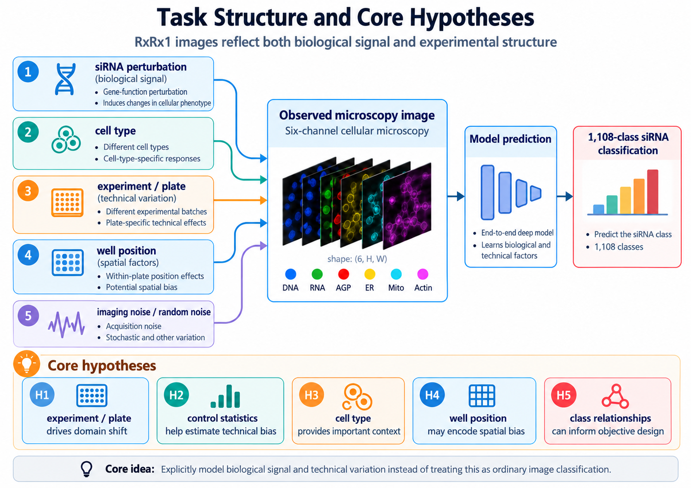
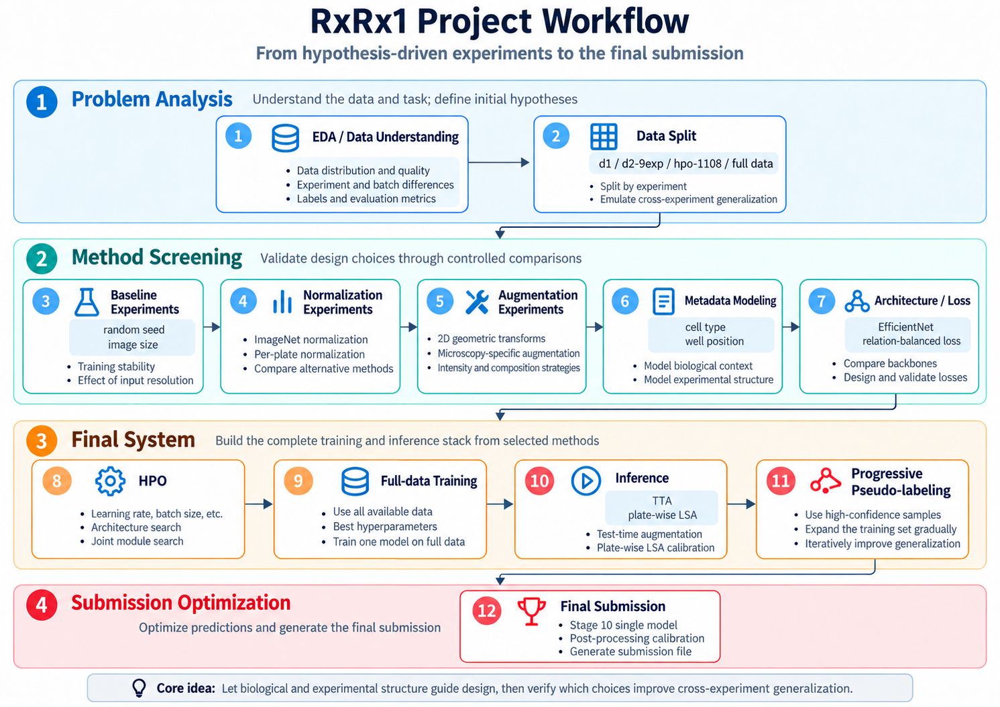
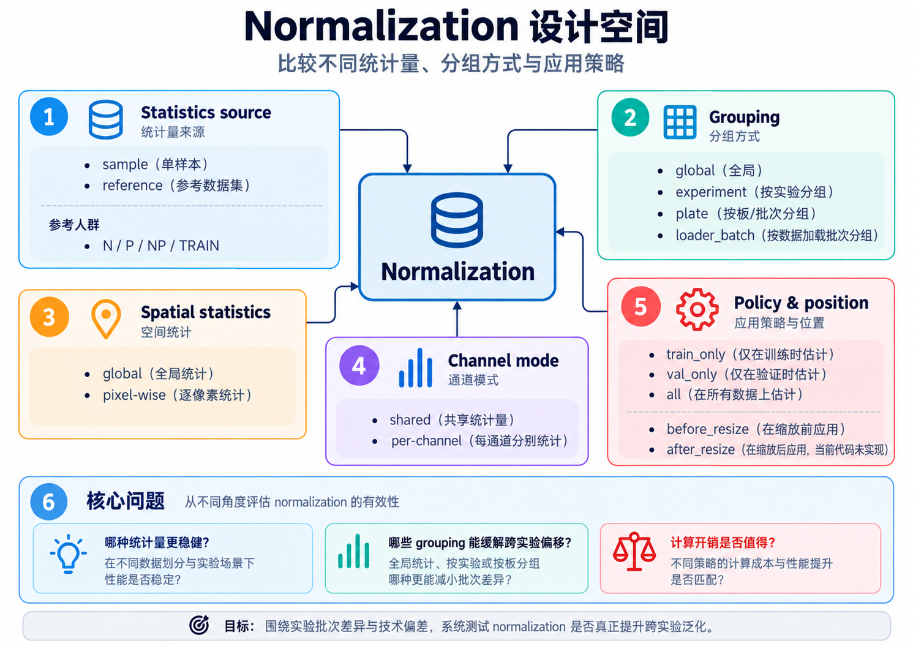
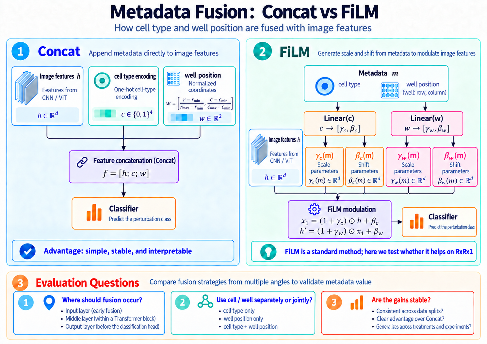
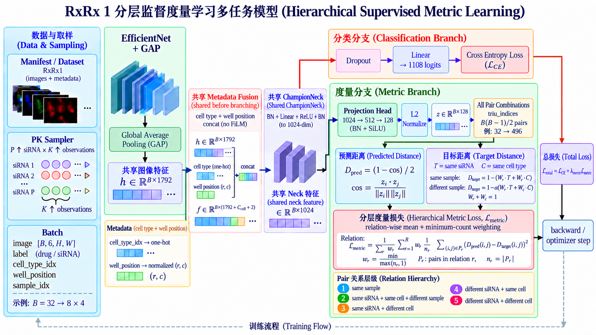
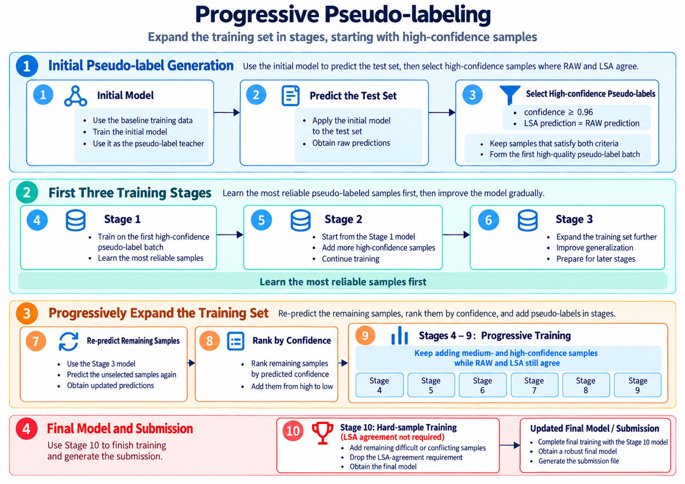
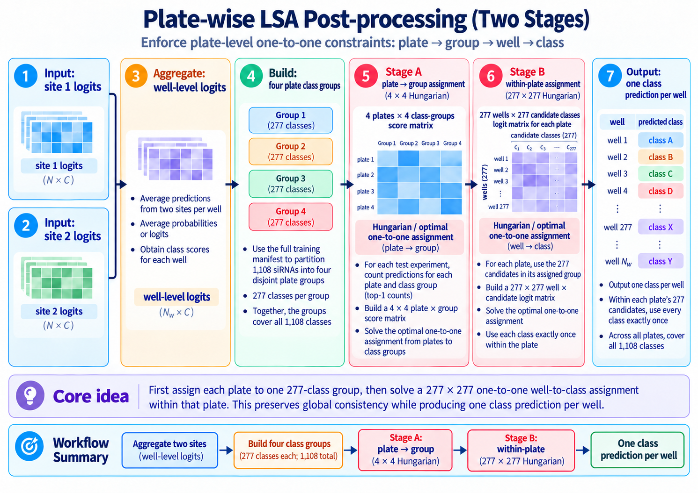

# RxRx1 Cellular Perturbation Classification

> **Biology-guided modeling of six-channel microscopy images for cross-experiment siRNA classification**

This project addresses Kaggle's **Recursion Cellular Image Classification (RxRx1)** challenge: predicting 1,108 siRNA treatments from six-channel fluorescence microscopy images acquired in **unseen experiments**. Beyond improving leaderboard performance, it translates the biological and experimental structure of RxRx1 into testable machine-learning hypotheses, then selects the final model through hierarchical proxy experiments, controlled comparisons, negative results, and error analysis.

## Final Result

| Item | Result |
|---|---|
| Task | 1,108-class siRNA classification |
| Input | 6-channel microscopy image |
| Final backbone | **EfficientNet-B4** |
| Input resolution | **512 × 512 × 6** |
| Metadata | Cell-type one-hot + normalized well position |
| Fusion | **Concatenation** |
| Training objective | Cross-entropy + hierarchical metric learning |
| Sampling | PK sampling, `P=8`, `K=4`, batch size `32` |
| Semi-supervised training | Progressive pseudo-labeling |
| Inference | TTA + site aggregation + plate-aware LSA |
| Stage 10 RAW | **Public 0.68494 / Private 0.90563** |
| Best submission | **Public 0.81132 / Private 0.97903** |

The best score in the historical leaderboard record reached the silver-medal range, but it should not be interpreted as the visual model's capability alone. Stage 10 RAW scored `0.68494 / 0.90563`, while plate-aware LSA contributed most of the final gain. This README therefore separates **core image modeling, target-domain pseudo-labeling, and competition-specific post-processing**. These leaderboard values and their submission files are not currently archived in the repository.

---

## Contents

- [1. Problem and Hypotheses](#1-problem-and-hypotheses)
- [2. Project Workflow](#2-project-workflow)
- [3. Dataset and Validation Strategy](#3-dataset-and-validation-strategy)
- [4. Baseline and Image Resolution](#4-baseline-and-image-resolution)
- [5. Normalization](#5-normalization)
- [6. Augmentation](#6-augmentation)
- [7. Metadata Modeling and Fusion](#7-metadata-modeling-and-fusion)
- [8. Final Model: Hierarchical Supervised Metric Learning](#8-final-model-hierarchical-supervised-metric-learning)
- [9. Full-data Training Configuration](#9-full-data-training-configuration)
- [10. Progressive Pseudo-labeling](#10-progressive-pseudo-labeling)
- [11. Inference: TTA and Plate-wise LSA](#11-inference-tta-and-plate-wise-lsa)
- [12. Final Results](#12-final-results)
- [13. Cell-type Error Analysis](#13-cell-type-error-analysis)
- [14. What Worked and What Did Not](#14-what-worked-and-what-did-not)
- [15. Evidence Boundary](#15-evidence-boundary)
- [16. Reproduction](#16-reproduction)
- [17. Repository Structure](#17-repository-structure)
- [18. Limitations and Future Work](#18-limitations-and-future-work)

---

# 1. Problem and Hypotheses

RxRx1 contains four cell types: **HEPG2, HUVEC, RPE, and U2OS**. Each experiment corresponds to one cell type and includes multiple plates. Every well is imaged at two sites, with six aligned channels per site. The key train/test difference is not a random image split: the **test set comes from unseen experiments**, creating substantial domain shift.



### Generative View

The observed image is treated as the joint outcome of biological signal and technical variation:

$$
(T,C) \rightarrow W \rightarrow P \rightarrow B \rightarrow I \rightarrow X
$$

- $T$: siRNA treatment, the prediction target;
- $C$: cell type, providing biological context for morphology and treatment response;
- $W$: well position, which may encode spatial technical bias;
- $P/B$: plate, batch, and experiment effects;
- $I$: imaging processes such as staining, exposure, and channel intensity;
- $\epsilon$: local noise and stochastic variation.

This is not a strict biological causal model. It is an **experimental-design framework** for deciding which variables to predict, which to provide as context, which technical differences to remove, and which variations the model should learn to ignore.

### Hypotheses

| Hypothesis | Question | Corresponding experiment |
|---|---|---|
| H1 | Do experiment and plate introduce substantial domain shift? | Experiment-level split, normalization |
| H2 | Can control statistics help estimate technical bias? | Reference normalization |
| H3 | Does cell type provide useful context? | One-hot encoding, fusion, metric hierarchy |
| H4 | Does well position encode spatial bias? | Normalized row/column + fusion |
| H5 | Can treatment/cell-type relationships constrain the representation? | Hierarchical metric learning |

---

# 2. Project Workflow



The project uses **hierarchical experimentation** instead of searching every design directly on full data:

1. **Problem analysis:** EDA, experiment/batch structure, labels, and validation design;
2. **Method screening:** seed, image size, normalization, augmentation, metadata, architecture, and loss;
3. **Final system:** HPO → full-data training → inference;
4. **Submission optimization:** progressive pseudo-labeling, TTA, site aggregation, and plate-aware LSA.

The main data stages were:

- `d1`
- `d2-9exp` (`d2_9exp_*`, historically also `d29`)
- `hpo-1108` (`hpo_1108_*`)
- `full data` (`full_all_*`)

This design reduces the cost of training on large six-channel images and prevents unvalidated ideas from being carried directly into final training.

---

# 3. Dataset and Validation Strategy

The training set contains **33 experiments**; the test set contains **18 unseen experiments**. Each experiment corresponds to one cell type, each well has two imaging sites, and each site contains six `512 × 512` channels.

> **Validation should approximate cross-experiment generalization as closely as possible.**

Randomly splitting images from one experiment across training and validation can let the model exploit batch, plate, illumination, or acquisition style, overestimating real generalization.

### Proxy Datasets

| Stage | Role |
|---|---|
| `d1` | 9 training experiments, 4 held-out validation experiments, 400 classes, and one site per well; fast screening of seeds, resolution, normalization, and basic backbones |
| `d2-9exp` / `d29` | Same experiment, cell-type, and class coverage as `d1`, but both sites; metadata-fusion experiments |
| `hpo-1108` | Same 9 + 4 experiment split, expanded to all 1,108 classes; architecture, loss, and hyperparameter selection |
| `full data` | All 33 training experiments and all 1,108 classes; followed by pseudo-label generation, cumulative curriculum training, and submission optimization |

Proxy-training cell-type experiment counts are approximately:

$$
\text{HEPG2:HUVEC:RPE:U2OS} \approx 2:4:2:1
$$

Full-training counts are `7:16:7:3`; test counts are `4:8:4:2`. U2OS is least represented in all three, an important context for its later failure mode.

---

# 4. Baseline and Image Resolution

The initial **ResNet18** baseline used a six-channel input and 1,108-class output. Repository records for seeds `0 / 42 / 2026 / 2386 / 3407` show standard deviations of approximately **0.21 / 0.28 percentage points** for final/best validation accuracy and ranges of approximately **0.44 / 0.62 percentage points**. A one-off change below roughly `0.2` percentage points is therefore not treated as stable without repeated-seed support.

### Resolution Experiment

| Image size | Train acc (ep3) | Val acc (ep3) | Val loss | Time / epoch |
|---:|---:|---:|---:|---:|
| 128 | 73.33% | 1.12% | 5.9074 | 2.76 min |
| 256 | 63.31% | 2.19% | 5.7017 | 6.91 min |
| 384 | 30.53% | 3.00% | 5.6221 | 10.58 min |
| 512 | 13.17% | **3.25%** | **5.5571** | 23.82 min |

*Runtime was measured on a local machine accessed through SSH.*

The proxy stage used **384** as a compromise between information retention and cost; final full-data training returned to **512**. This trend is plausible because siRNA phenotypes can appear in local structures such as mitochondria, nucleoli, the cytoskeleton, and cell boundaries.

---

# 5. Normalization



Normalization received the most systematic controlled comparisons because it directly targets experiment- and plate-level technical variation.

- **Method/enabled:** none / z-score
- **Statistics source:** sample / reference
- **Reference population:** N / P / NP / TRAIN
- **Grouping:** global / experiment / plate / loader batch
- **Spatial statistics:** global / pixel-wise
- **Channel mode:** shared / per-channel
- **Split policy:** train-only / val-only / all
- **Application position:** before / after resize

The current image-level Dataset does not implement `after_resize`; it represents the historical design space, not a directly reproducible path.

### Main Decisions

| Question | Comparison | Conclusion |
|---|---|---|
| Is reference normalization useful? | None vs reference | Reference performed better |
| Reference population | N / P / NP / TRAIN | **NP** |
| Channel statistics | Shared vs per-channel | **Shared** was more stable |
| Grouping | Global / experiment / plate | Plate beat none but trailed global/experiment |
| Unseen test experiment | Global vs experiment | Similar; **global** selected for stability |
| Statistics boundary | Train-only / val-only / all | **Train-only** |
| Resize order | Before / after resize | **Before resize + population standard deviation** |

Final full-data normalization:

> **Train-only NP reference + shared-channel global statistics + before-resize population standard deviation**

---

# 6. Augmentation

Basic geometric augmentations included horizontal and vertical flips, 90° rotation, and crop-resize (early experiments only; not in the final full-data config). They reduce dependence on absolute orientation, position, and scale. Because each transform was not ablated independently, no individual gain is claimed.

| Method | Interpretation | Decision |
|---|---|---|
| MixUp | Smooth class boundaries and reduce overconfidence | Effective, but weaker than CutMix |
| **CutMix** | Combine local morphology and strengthen regularization | **Retained** |
| **Per-channel intensity jitter** | Simulate staining/imaging intensity variation | **Retained** |
| **Channel dropout** | Prevent overreliance on a single structural channel | **Retained** |

---

# 7. Metadata Modeling and Fusion



Two metadata sources are modeled: **cell type** as biological context and **well position** as possible spatial technical context.

> **Implementation note:** `cell_type_idx` is represented as a **one-hot vector**, while `well_position` uses normalized 2D coordinates. Neither necessarily passes through a learnable embedding.

$$
c \in \{0,1\}^4,
\qquad
w=\left[\frac{r-r_{\min}}{r_{\max}-r_{\min}},\frac{c-c_{\min}}{c_{\max}-c_{\min}}\right]
$$

The final metric-neck model directly concatenates pooled image features and metadata:

$$
f=[h;c;w]
$$

FiLM generates feature-wise scale and shift from metadata:

$$
h'=\gamma(m)\odot h+\beta(m)
$$

Early, middle, late, and output injection were tested, but FiLM is **not the final fusion method**.

### Metadata Experiment

| Dataset | Configuration | Best val accuracy | Final val loss |
|---|---|---:|---:|
| D1 | Baseline | **13.8125%** | 6.4252 |
| D1 | Well concatenation | **13.8125%** | 6.6110 |
| D1 | Cell-type FiLM | 13.5625% | 6.7347 |
| D1 | Cell-type FiLM (LR HPO) | 13.6250% | 6.7806 |
| D1 | Well FiLM (early) | 13.5000% | 6.7865 |
| D1 | Cell-type FiLM (mid) | 13.4375% | 6.7893 |
| D1 | Well FiLM (EfficientNet output) | 13.0625% | 6.8264 |
| d2-9exp (`d29`) | Classification baseline | 19.2813% | 6.8234 |
| d2-9exp (`d29`) | Well + cell-type concatenation | **19.4063%** | 6.9069 |
| d2-9exp (`d29`) | Early well FiLM + cell-type concatenation | 18.9688% | **6.6282** |

Well concatenation tied the D1 baseline; D1 showed no clear top-1 gain from metadata. Dual concatenation was slightly more accurate on d2-9exp, while early FiLM had lower accuracy but lower validation loss. **Cell type + well-position concatenation** was selected because it is **simple, stable, reproducible, and showed no obvious proxy-stage harm**, not because metadata was proven to provide an independent gain.

---

# 8. Final Model: Hierarchical Supervised Metric Learning



```text
6-channel image → EfficientNet → Global Average Pooling → image feature
→ Concat(cell-type one-hot, normalized well position) → Shared ChampionNeck
├── Classification branch
└── Metric branch
```

ResNet18 was used for the baseline, EfficientNet-B2 for intermediate validation, and **EfficientNet-B4** for the final model. After metadata concatenation, a shared neck creates a joint representation before the task branches.

```text
Classification: shared feature → Dropout → Linear → 1,108 logits → Cross-entropy
Metric: shared feature → 1024 → 512 → 128 projection → L2 normalization
        → pair construction → predicted/target distance → hierarchical metric loss
```

Final hyperparameters:

- $\lambda_{\text{metric}} = 0.052$
- $w_t = 0.63$
- $w_c = 0.37$
- $\alpha = 0.92$
- `min_pairs = 8`

The larger treatment weight emphasizes treatment relationships. Classification still dominates optimization because $\lambda_{\text{metric}}$ is small.

$$
\mathcal{L}_{\text{total}}=\mathcal{L}_{\text{CE}}+\lambda_{\text{metric}}\mathcal{L}_{\text{metric}}
$$

The metric branch applies relation-wise weighted **squared error** between predicted and target distances. Pairs represent: same sample; same treatment/same cell/different sample; same treatment/different cell; different treatment/same cell; or different treatment/different cell. The main observed effects were lower validation-loss growth, reduced overconfidence, and a more stable feature space—not a large direct top-1 gain.

---

# 9. Full-data Training Configuration

| Component | Final setting |
|---|---|
| Backbone | EfficientNet-B4 |
| Input | 512 × 512 × 6 |
| Normalization | Train-only NP reference; shared-channel global statistics; before-resize population standard deviation |
| Augmentation | CutMix, per-channel intensity jitter, channel dropout, geometric augmentation |
| Metadata | Cell-type one-hot + normalized well position; concatenation |
| Neck | Shared single neck |
| Sampling | PK sampling, `P=8`, `K=4`, batch size 32 |
| Loss | Cross-entropy + hierarchical metric loss |
| Optimizer | AdamW |
| Base LR | `6e-5` |
| Weight decay | `1.6e-4` |
| Schedule | Cosine decay + approximately 5% warmup |
| Production epochs | 70 |
| Teacher checkpoint | Epoch 54 snapshot (not distributed) |

With `P=8, K=4`, every treatment contributes $\binom{4}{2}=6$ unordered positive pairs, for 48 same-treatment pairs per batch. The historical production run largely plateaued after epoch 43, with little gain after epoch 50; epoch 54 was selected as the pseudo-label teacher after considering RAW, TTA, and LSA performance.

> **Repository boundary**
> The 70-epoch production configuration is committed as `configs/final_selection/02_aggressive.yaml`; it resumes from `outputs/checkpoints/final_select_aggressive/last.pt`. The repository also includes inference variants for RAW, TTA, LSA, and TTA + LSA selection. Checkpoints and generated outputs remain excluded, so the exact historical run still requires the corresponding local artifacts.

---

# 10. Progressive Pseudo-labeling



| Configuration | Public | Private |
|---|---:|---:|
| Teacher RAW | 0.54254 | 0.78417 |
| Teacher + TTA + LSA | 0.75942 | 0.96371 |

The first pseudo-label set required:

```text
confidence ≥ 0.96
AND
RAW prediction == LSA prediction
```

It contained **6,729 / 19,897 wells** (about **33.8%** of test wells). Pseudo-samples were trained with real data while retaining PK sampling.

The public curriculum implementation uses the fixed teacher state generated above and adds pseudo-labeled wells cumulatively:

- **Stages 1–6:** remaining RAW/LSA-agreement samples are sorted by confidence and added from higher to lower confidence;
- **Stages 7–10:** RAW/LSA-disagreement samples are then sorted by confidence and added progressively;
- every stage retains all pseudo-labeled wells introduced in earlier stages;
- training uses mixed real/pseudo PK sampling, with one pseudo observation per selected treatment when available.

| Stage | Public | Private | Interpretation |
|---|---:|---:|---|
| Stage 3 | 0.60460 | 0.84051 | Progressive high-confidence consistent samples |
| Stage 6 | 0.63529 | 0.87742 | Main consistent-sample expansion completed |
| Stage 8 | 0.67140 | 0.89567 | Difficult samples begin to be covered |
| Stage 10 | **0.68494** | **0.90563** | Final RAW checkpoint in the report |

> **Reproducibility note**
> The repository now includes pseudo-label generation (`scripts/generate_pseudo_round.py`), mixed real/pseudo sampling, round-1 configuration, cumulative ten-stage curriculum training (`scripts/train_pseudo_curriculum.py`), and the post-Stage-10 consolidation configuration. Generated manifests, logits, checkpoints, and raw images remain excluded; reproducing the exact historical lineage therefore requires regenerating those artifacts or supplying the original checkpoints.

Further consolidation with `confidence ≥ 0.95` reduced performance; checkpoint-logit ensembling also produced no significant gain.

---

# 11. Inference: TTA and Plate-wise LSA



TTA averages logits from lossless transforms such as horizontal/vertical flips and 90° rotations. Two sites are averaged per well:

$$
z_{\text{well}}=\frac{z_{\text{site1}}+z_{\text{site2}}}{2}
$$

The plate-aware LSA implementation is:

```text
site logits → well logits
→ build 4 disjoint class groups (277 classes each) from the full train manifest
→ Stage A: 4 plates × 4 groups score matrix per test experiment
→ Hungarian assignment: plate → class group
→ Stage B: 277 wells × 277 candidate classes logit matrix per plate
→ Hungarian assignment: well → class
→ globally consistent well-level assignment
```

LSA is a **competition- and experimental-design-specific strong prior**, not a generally transferable improvement for arbitrary biological imaging tasks.

---

# 12. Final Results

| Configuration | Public | Private | Role |
|---|---:|---:|---|
| Stage 10 RAW | 0.68494 | 0.90563 | Pseudo-labeled model itself |
| Stage 10 + TTA | 0.68900 | 0.91099 | Small, stable multi-view gain |
| Stage 10 + LSA | 0.80185 | 0.97736 | Main plate-level constraint gain |
| **Stage 10 + TTA + LSA** | **0.81132** | **0.97903** | **Best submission** |

These values come from historical submission records; submission files, generated logits, checkpoints, and their full lineage are not distributed. TTA adds Public `+0.00406` and Private `+0.00536`; LSA adds substantially more. The final score combines **core modeling**, **target-domain pseudo-labeling**, and a **competition-specific inference prior**.

---

# 13. Cell-type Error Analysis

Wells and experiments below refer to the **test set**; training experiment counts are `7 / 16 / 7 / 3` for HEPG2 / HUVEC / RPE / U2OS.

| Cell type | Wells | Exps | Mean conf | Median conf | Margin | Entropy | LSA flip |
|---|---:|---:|---:|---:|---:|---:|---:|
| **U2OS** | 2,205 | 2 | **0.37264** | **0.16116** | 0.32190 | **3.65511** | **54.20%** |
| RPE | 4,417 | 4 | 0.79687 | 0.98486 | 0.75615 | 1.04563 | 13.29% |
| HEPG2 | 4,429 | 4 | 0.81538 | 0.98811 | 0.77823 | 0.97409 | 10.73% |
| HUVEC | 8,846 | 8 | **0.91888** | **0.99900** | **0.89410** | **0.38474** | **5.16%** |

U2OS is the clearest failure mode: mean confidence 0.37264, median confidence 0.16116, entropy 3.65511, and 54.2% of RAW predictions changed by LSA. Current evidence supports two data-level explanations: cell-type exposure is imbalanced, and U2OS has the fewest experiments. Repetition within a batch cannot create cross-experiment diversity. Intrinsically harder U2OS morphology or response remains an untested hypothesis.

---

# 14. What Worked and What Did Not

## What Worked

- Higher resolution improved proxy validation;
- reference normalization beat no normalization;
- NP reference + shared global statistics was more stable;
- CutMix beat MixUp;
- per-channel intensity jitter and channel dropout were retained;
- concatenation was simpler and more stable than FiLM;
- metric learning acted mainly as a representation regularizer;
- progressive pseudo-labeling improved the RAW model;
- TTA provided a small, stable gain;
- plate-aware LSA provided the largest inference gain.

## No Clear Independent Gain

- Well concatenation tied the D1 baseline;
- cell-type metadata lacked evidence of an independent top-1 gain;
- several FiLM settings did not beat the D1 baseline;
- early FiLM on d2-9exp had lower loss but lower accuracy;
- post-Stage-10 consolidation degraded performance;
- checkpoint-logit ensembling gave no significant gain.

---

# 15. Evidence Boundary

```text
Observation → Model evidence → Supported interpretation → Causal conclusion
```

**Reference normalization:** It improved validation performance, supporting experiment-dependent technical variation as part of domain shift. It does not establish that batch effects were fully removed or their physical/biological source identified.

**Metadata:** d2-9exp dual concatenation slightly improved top-1 over baseline, while FiLM had no stable gain. Metadata can be integrated safely, but its independent contribution needs controlled ablation.

**LSA:** It produced a large leaderboard gain, showing that plate-level constraints correct many local prediction errors. It does not mean the visual representation itself achieved 0.97903 Private accuracy.

---

# 16. Reproduction

Python `>=3.12`; dependencies are managed by `uv`.

```bash
git clone https://github.com/inori6/rxrx1.git
cd rxrx1
uv sync
```

Main dependencies: PyTorch/torchvision, timm, Albumentations, OpenCV, pandas, NumPy, SciPy, Optuna, W&B, and PyYAML.

## Training

```bash
uv run python scripts/train.py \
  --config configs/<your_config>.yaml
```

Production configuration:

```bash
uv run python scripts/train.py \
  --config configs/final_selection/02_aggressive.yaml
```

This configuration defines the 70-epoch adaptive continuation run and resumes from `outputs/checkpoints/final_select_aggressive/last.pt`. Set `training.resume_from` to `null` when starting without that local checkpoint.

## Test Inference and Submission

The test entry point supports site-mean aggregation, D4 TTA, optional plate-aware LSA, official `sirna_id` mapping through `data/sirna_id_map.csv`, RAW submission export, and well-logit caching. A RAW example is:

```bash
uv run python scripts/predict_test_submit.py \
  --config configs/final_selection/02_aggressive_raw_infer.yaml \
  --checkpoint outputs/checkpoints/<run>/last.pt \
  --output outputs/submission.csv
```

For TTA with reusable well logits:

```bash
uv run python scripts/predict_test_submit.py \
  --config configs/final_selection/02_aggressive_tta_final.yaml \
  --checkpoint outputs/checkpoints/final_select_aggressive/model_snapshots/epoch_54_trainacc_0.5187.pt \
  --output outputs/submissions/epoch54_tta.csv \
  --logits-output outputs/submissions/epoch54_tta_logits.pkl \
  --norm-stats-source train
```

Apply LSA without repeating GPU inference:

```bash
uv run python scripts/apply_lsa_from_logits.py \
  --config configs/final_selection/02_aggressive_tta_final.yaml \
  --logits outputs/submissions/epoch54_tta_logits.pkl \
  --output outputs/submissions/epoch54_tta_lsa.csv
```

The final-selection helper evaluates epochs 50, 54, and 59 with TTA and cached-logit LSA:

```bash
bash scripts/pipelines/run_final_tta_selection.sh
```

Full-data configs disable validation, so use `last.pt` or an explicitly selected `model_snapshots/` checkpoint rather than assuming that `best.pt` exists.

## Pseudo-label Curriculum

Generate the first confidence- and LSA-filtered pseudo-label state from the epoch 54 teacher:

```bash
uv run python scripts/generate_pseudo_round.py \
  --config configs/final_selection/02_aggressive_tta_final.yaml \
  --checkpoint outputs/checkpoints/final_select_aggressive/model_snapshots/epoch_54_trainacc_0.5187.pt \
  --threshold 0.96 \
  --output-dir outputs/pseudo/round1/teacher \
  --save-logits
```

Train the first pseudo round, followed by the cumulative ten-stage curriculum:

```bash
uv run python scripts/train.py \
  --config configs/pseudo/round1_conf096.yaml

uv run python scripts/train_pseudo_curriculum.py \
  --config configs/pseudo/round2_curriculum10.yaml
```

The negative post-Stage-10 consolidation experiment is retained as `configs/pseudo/post_stage10_conf095_e5.yaml`; it is not the best Stage 10 configuration. All commands require the referenced raw data and locally generated artifacts.

### Local Data Layout

```text
# Training
data/raw/rxrx1_original_512/images/<experiment>/Plate<plate>/...

# Test submission
data/raw/train/<experiment>/Plate<plate>/...
data/raw/test/<experiment>/Plate<plate>/...
data/raw/test.csv
data/raw/sample_submission.csv
```

Raw Kaggle data is not committed.

---

# 17. Repository Structure

```text
rxrx1/
├── assets/
│   └── figures/       # README figures
├── analysis/          # experiment analysis
├── configs/
│   ├── final_selection/ # production and inference variants
│   └── pseudo/          # round 1, curriculum, and consolidation configs
├── data/              # manifests / processed metadata / local data layout
├── kaggle/            # Kaggle runner and kernel-metadata template
├── notebooks/         # exploratory analysis
├── scripts/
│   ├── train.py
│   ├── train_pseudo_curriculum.py
│   ├── generate_pseudo_round.py
│   ├── predict_test_submit.py
│   ├── apply_lsa_from_logits.py
│   ├── evaluate_inference.py
│   ├── hpo.py
│   ├── hpo_fusion.py
│   └── pipelines/
│       └── run_final_tta_selection.sh
├── src/rxrx1/
│   ├── data/
│   ├── inference/
│   ├── models/
│   ├── training/
│   └── utils/
├── tests/
├── pyproject.toml
├── uv.lock
└── README.md
```

Core model files include `metadata.py`, `efficientnet.py`, `efficientnet_metric_neck.py`, and `training/trainer.py` under `src/rxrx1/`.

---

# 18. Limitations and Future Work

- Proxy validation only approximates the hidden leaderboard distribution;
- metadata may correlate with both technical bias and biological context;
- pseudo-labeling may introduce confirmation bias;
- plate-aware LSA strongly depends on the RxRx1 design;
- high Private scores can hide subgroup failures such as U2OS;
- classification performance does not establish biological causality.

### Highest-priority Next Experiment: U2OS-aware Sampling

- Hierarchical balanced sampling: cell type → experiment → treatment-aware PK sampling;
- try approximately `50% natural + 50% balanced`;
- continue from the Stage 10 checkpoint;
- use `0.1–0.2×` the original learning rate;
- train 1–3 epochs first;
- monitor confidence, margin, entropy, and LSA flip by cell type.

---

## Takeaway

The main point is not simply: “I combined EfficientNet, pseudo-labeling, and LSA on Kaggle.”

> **I translated the biological and experimental structure of RxRx1 into testable hypotheses, screened designs through proxy datasets and controlled experiments, and integrated the modules that were validated—or at least shown to be stable—into a reproducible training, inference, and semi-supervised system.**

```text
Understand the data-generating structure → Form hypotheses → Design controlled experiments
→ Record positive and negative results → Build the final model → Target-domain pseudo-labeling
→ TTA / site aggregation / LSA → Subgroup diagnosis → Next testable experiment
```

---

## References

- RxRx1 dataset: https://www.rxrx.ai/rxrx1
- Kaggle: Recursion Cellular Image Classification
